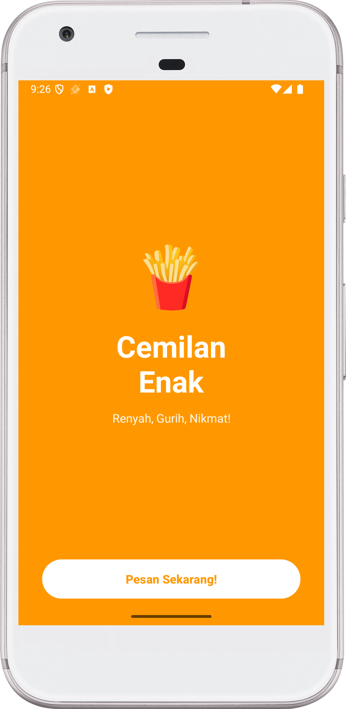
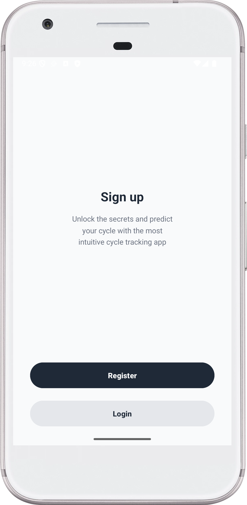
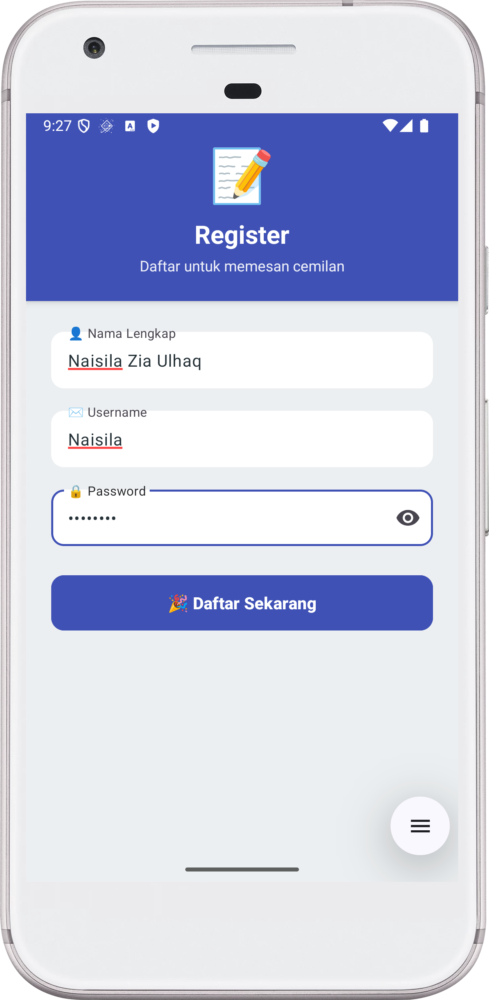
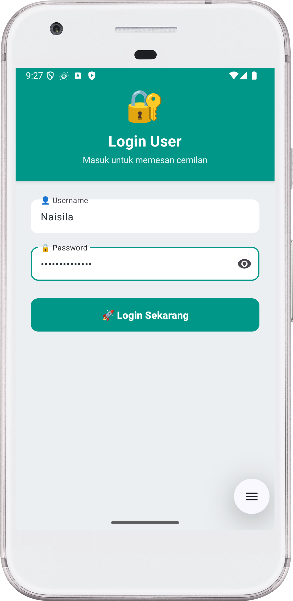
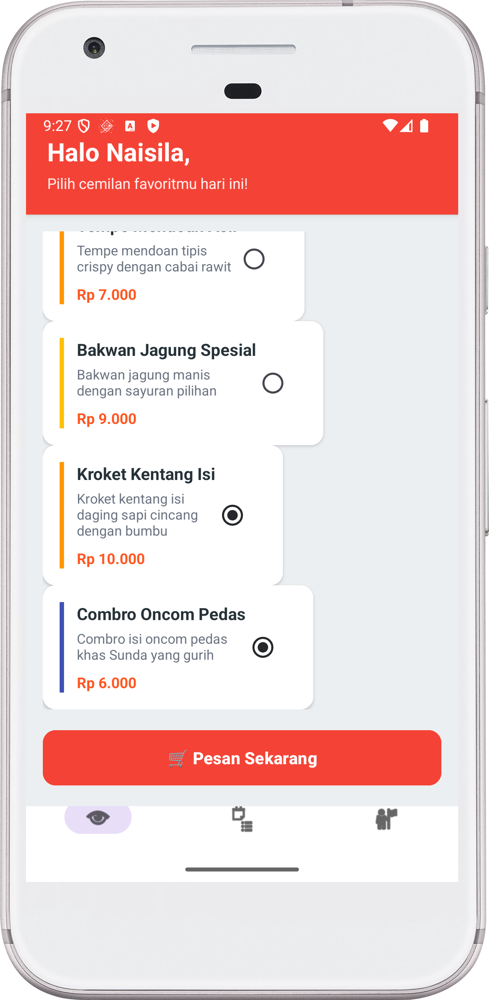
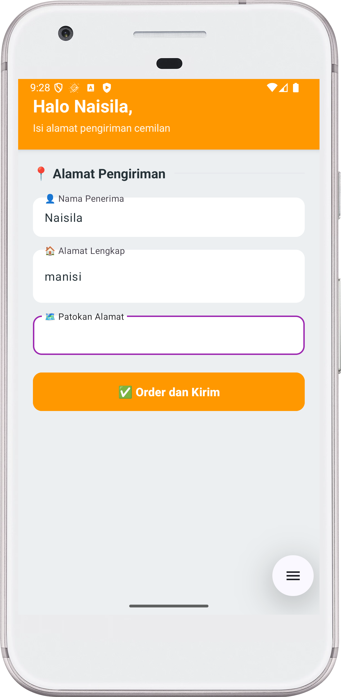
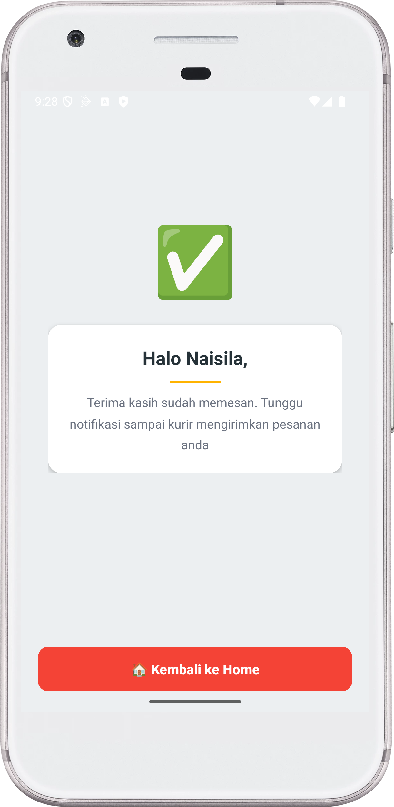

# 🍟 Cemilan Enak - Aplikasi Pemesanan Cemilan Renyah

Aplikasi Android untuk memesan berbagai cemilan renyah dan gurih dengan desain modern dan colorful yang dibuat menggunakan Kotlin dan View Binding.

## 📱 Tentang Aplikasi

**Cemilan Enak** adalah aplikasi mobile yang memudahkan pengguna untuk memesan berbagai cemilan renyah dengan antarmuka yang menarik dan user-friendly. Aplikasi ini menampilkan 12 menu cemilan dengan informasi lengkap termasuk nama, deskripsi, dan harga.

## ✨ Fitur Utama

- ✅ **Autentikasi User** - Login dan Register
- ✅ **12 Menu Cemilan** - Pilihan cemilan renyah dan gurih
- ✅ **Review Pesanan** - Melihat detail pesanan sebelum checkout
- ✅ **Input Alamat** - Form pengisian alamat pengiriman yang lengkap
- ✅ **Konfirmasi Pesanan** - Notifikasi sukses setelah order
- ✅ **Bottom Navigation** - Navigasi mudah antar halaman
- ✅ **Desain Modern** - UI/UX menarik dengan warna-warna cerah
- ✅ **Material Design** - Menggunakan Material Components

## 📸 Screenshot Aplikasi

Berikut adalah dokumentasi aplikasi yang sudah berjalan dengan sukses:

### 1. Splash Screen

- Background orange cerah dengan emoji cemilan 🍟
- Judul "Cemilan Enak" dengan tagline "Renyah, Gurih, Nikmat!"
- Tombol "Pesan Sekarang!" untuk memulai

### 2. Auth Choice

- Pilihan untuk Register atau Login
- Deskripsi singkat aplikasi
- Tombol dengan warna berbeda untuk setiap pilihan

### 3. Login

- Header teal dengan emoji 🔐
- Form login dengan username dan password
- Material TextInputLayout dengan icon
- Password toggle untuk show/hide password
- Tombol "🚀 Login Sekarang" dengan warna teal

### 4. Register

- Header indigo dengan emoji 📝
- Form registrasi lengkap (Nama, Username, Password)
- Material Design Components
- Tombol "🎉 Daftar Sekarang" dengan warna indigo

### 5. Home - Daftar Cemilan

- Header merah dengan sapaan personal
- Subtitle "Pilih cemilan favoritmu hari ini!"
- Section title "🍟 Menu Cemilan"
- 12 menu cemilan dalam card menarik:
  - Keripik Singkong Pedas - Rp 8.000
  - Pisang Goreng Crispy - Rp 10.000
  - Tahu Crispy Isi - Rp 7.000
  - Cireng Bumbu Rujak - Rp 6.000
  - Makaroni Goreng Pedas - Rp 9.000
  - Sukun Goreng Keju - Rp 11.000
  - Risoles Mayo Premium - Rp 12.000
  - Lumpia Mini Sayur - Rp 8.000
  - Tempe Mendoan Asli - Rp 7.000
  - Bakwan Jagung Spesial - Rp 9.000
  - Kroket Kentang Isi - Rp 10.000
  - Combro Oncom Pedas - Rp 6.000
- Setiap card menampilkan nama, deskripsi, harga, dan color indicator
- RadioButton terintegrasi dalam card
- Bottom Navigation Bar (Home, Order, Profile)

### 6. Review Pesanan

- Header amber (kuning keemasan) dengan informasi user
- Subtitle "Review pesanan cemilan kamu"
- Card putih menampilkan pesanan yang dipilih
- Tombol "🚀 Lanjut ke Pengiriman" dengan warna amber
- Bottom Navigation Bar

### 7. Alamat Pengiriman

- Header orange dengan sapaan personal
- Subtitle "Isi alamat pengiriman cemilan"
- Form input alamat lengkap:
  - 👤 Nama Penerima
  - 🏠 Alamat Lengkap
  - 🗺️ Patokan Alamat
- Material TextInputLayout dengan icon
- Tombol "✅ Order dan Kirim" dengan warna orange

> **Catatan**: Aplikasi sudah dijalankan dengan sukses dan semua fitur telah diuji. Screenshot di atas merupakan bukti bahwa aplikasi berjalan dengan baik.

## 🛠️ Teknologi yang Digunakan

- **Bahasa**: Kotlin
- **SDK**: Android SDK (Min SDK 24, Target SDK 36)
- **Build Tool**: Gradle 8.13
- **Architecture Pattern**: MVVM (Model-View-ViewModel)
- **UI Components**:
  - View Binding
  - Material Design Components
  - ConstraintLayout
  - ScrollView
  - Material TextInputLayout
  - Material CardView
  - Bottom Navigation View

## 📁 Struktur Project

```
PraktikumWireframe/
├── app/
│   ├── src/
│   │   ├── main/
│   │   │   ├── java/com/example/praktikumwireframe/
│   │   │   │   ├── SplashActivity.kt          # Splash screen
│   │   │   │   ├── AuthChoiceActivity.kt      # Pilihan auth
│   │   │   │   ├── LoginActivity.kt           # Login
│   │   │   │   ├── RegisterActivity.kt        # Register
│   │   │   │   ├── HomeActivity.kt            # Daftar cemilan
│   │   │   │   ├── OrderReviewActivity.kt     # Review pesanan
│   │   │   │   ├── AddressActivity.kt         # Input alamat
│   │   │   │   ├── ConfirmActivity.kt         # Konfirmasi
│   │   │   │   ├── FoodItem.kt                # Data class cemilan
│   │   │   │   └── OrderData.kt               # Singleton data order
│   │   │   ├── res/
│   │   │   │   ├── layout/                    # Layout files
│   │   │   │   ├── values/
│   │   │   │   │   ├── colors.xml             # Definisi warna
│   │   │   │   │   └── strings.xml
│   │   │   │   ├── menu/
│   │   │   │   │   └── menu_bottom.xml
│   │   │   │   └── drawable/
│   │   │   └── AndroidManifest.xml
│   │   └── build.gradle.kts
│   └── ...
├── screenshot/                                 # Folder screenshot (7 files)
│   ├── 01_splash.png
│   ├── 02_auth_choice.png
│   ├── 03_login.png
│   ├── 04_register.png
│   ├── 05_home.png
│   ├── 06_order_review.png
│   └── 07_address.png
└── README.md
```

## 🎨 Skema Warna

Aplikasi menggunakan skema warna yang renyah dan menarik untuk tema cemilan:

- **Orange Snack**: `#FF9800` - Splash, Address
- **Red Snack**: `#F44336` - Home header dan button
- **Teal Snack**: `#009688` - Login header dan button
- **Indigo Snack**: `#3F51B5` - Register header dan button
- **Amber Snack**: `#FFC107` - Order review
- **Dark Gray**: `#1F2937` - Text primary
- **Light Gray Background**: `#F9FAFB` - Background
- **Medium Gray**: `#9CA3AF` - Text secondary

## 🚀 Cara Menjalankan Aplikasi

### Prasyarat
- Android Studio Arctic Fox atau lebih baru
- JDK 11 atau lebih tinggi
- Android SDK dengan API Level 24 atau lebih tinggi
- Emulator Android atau perangkat fisik

### Langkah-langkah

1. **Clone Repository**
   ```bash
   git clone https://github.com/hilmanmaulana1237/UTS_HilmanMaulana_PAM.git
   cd PraktikumWireframe
   ```

2. **Buka di Android Studio**
   - Buka Android Studio
   - File → Open → Pilih folder project
   - Tunggu Gradle sync selesai

3. **Build Project**
   ```bash
   ./gradlew build
   ```
   atau melalui Android Studio: Build → Make Project

4. **Run Aplikasi**
   - Pilih device/emulator
   - Klik tombol Run (▶️) atau Shift+F10
   - Aplikasi akan terinstall dan berjalan

## 📦 Komponen Utama

### Data Classes

**FoodItem.kt**
```kotlin
data class FoodItem(
    val id: Int,
    val name: String,
    val description: String,
    val price: String,
    val colorRes: Int
)
```

**OrderData.kt** - Singleton untuk menyimpan data pesanan
```kotlin
object OrderData {
    var namaUser: String = ""
    val makananDipilih = mutableListOf<String>()
    var namaPenerima: String = ""
    var alamat: String = ""
    var patokan: String = ""
}
```

### Activities

1. **SplashActivity** - Landing page dengan branding cemilan
2. **AuthChoiceActivity** - Pemilihan Login/Register
3. **LoginActivity** - Autentikasi user
4. **RegisterActivity** - Pendaftaran user baru
5. **HomeActivity** - Menampilkan 12 menu cemilan
6. **OrderReviewActivity** - Review pesanan sebelum checkout
7. **AddressActivity** - Input alamat pengiriman
8. **ConfirmActivity** - Konfirmasi pesanan berhasil

## 🎯 Flow Aplikasi

```
Splash Screen
    ↓
Auth Choice (Register/Login)
    ↓
Login/Register Form
    ↓
Home (Pilih Cemilan)
    ↓
Order Review
    ↓
Address Input
    ↓
Confirmation
    ↓
Back to Home
```

## 💡 Fitur Khusus

### 1. Dynamic Snack List
- Menu cemilan di-generate secara dinamis dari FoodData
- Setiap item memiliki color indicator yang berbeda
- Click anywhere on card untuk memilih

### 2. Material Design Components
- TextInputLayout dengan icon dan hint animasi
- Password toggle untuk show/hide
- CardView dengan elevation dan rounded corners
- Bottom Navigation dengan custom styling

### 3. Data Persistence
- Menggunakan Singleton pattern untuk OrderData
- Data user dan pesanan tersimpan selama session

### 4. User Experience
- Sapaan personal di setiap halaman
- Toast notification untuk validasi
- Smooth navigation flow
- Responsive design dengan tema cemilan yang konsisten

## 📝 Dependencies

```kotlin
dependencies {
    implementation(libs.androidx.core.ktx)
    implementation(libs.androidx.appcompat)
    implementation(libs.material)
    implementation(libs.androidx.activity)
    implementation(libs.androidx.constraintlayout)
}
```

## 👨‍💻 Pengembang

- **Nama**: Hilman Maulana
- **Repository**: UTS_HilmanMaulana_PAM
- **GitHub**: hilmanmaulana1237
- **Mata Kuliah**: Pemrograman Aplikasi Mobile

## 📄 Status Build

✅ **Build Successful** - Aplikasi telah berhasil di-compile dan dijalankan
✅ **All Features Working** - Semua fitur berjalan dengan baik
✅ **Screenshots Documented** - 7 screenshot tersedia di folder `/screenshot`

## 🙏 Terima Kasih

Terima kasih kepada:
- Dosen pengampu mata kuliah Pemrograman Aplikasi Mobile
- Teman-teman yang telah membantu
- Referensi Material Design dari Google

---

**© 2025 Cemilan Enak - Aplikasi Pemesanan Cemilan Renyah**

*Dibuat dengan ❤️ menggunakan Kotlin & Material Design*

*Build Date: October 31, 2025*
